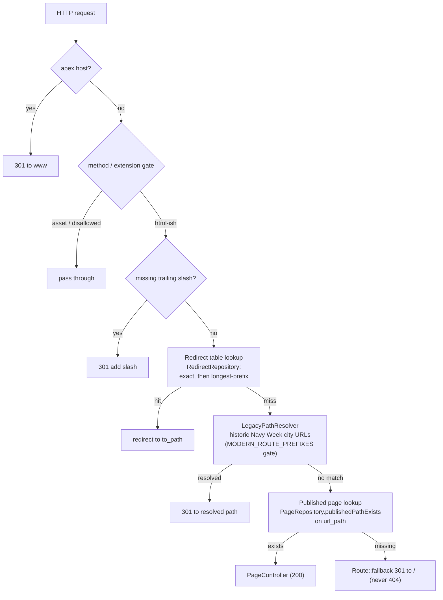
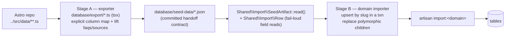

# NavyWeek Platform — architecture

Living architecture diagram for the Laravel rebuild. **Keep it current:** any change
that adds/removes a table, model, repository, middleware, service, event/listener,
or request-flow step must update this file in the same PR (see `platform/CLAUDE.md`).

Scope reflects what is **built so far**. (Earlier revisions drew planned-but-not-yet-built
entities with dashed borders; with the Phase-2 schema complete, none remain.)

Last updated: Phase 2 slice 10b — Jet-teams sub-silo: `jet_teams` (Blue Angels /
Thunderbirds hubs) with `jet_team_schedule` (every tour stop) and `jet_team_cities`
(published city guides) children; guides reuse the shared polymorphic `faqs`/`sources`.
This completes the Phase-2 schema work — the full data migration (Stage-A/Stage-B) is next.
(Slice 10a: navy week / fleet weeks / air shows guides.)

## Domain modules & data access

Domain-first modular monolith under `app/Domain/*`. Callers depend on repository
**interfaces**; the Eloquent implementations are bound in `DomainServiceProvider`.

```mermaid
flowchart TB
    subgraph Crm["Crm module (brands / pipeline)"]
        Connection["Connection (model)"]
        ConnectionAlias["ConnectionAlias (model)"]
        ConnIface["ConnectionRepositoryInterface"]
        ConnRepo["EloquentConnectionRepository"]
        ConnStatus["enum ConnectionStatus"]
        AudienceEnum["enum Audience"]
        AudienceModel["Audience (model)<br/>offer_audience lookup"]
        ConnRepo -. implements .-> ConnIface
        ConnRepo --> Connection
        ConnRepo --> ConnectionAlias
        ConnectionAlias -->|belongsTo| Connection
        Connection -->|"duplicate_of (self-ref)"| Connection
        AudienceModel -.seeded from.-> AudienceEnum
    end

    subgraph Catalog["Catalog module (offers, affiliate, directories)"]
        Offer["Offer (model)"]
        OfferTier["OfferTier (model)"]
        RedemptionStep["RedemptionStep (model)"]
        OfferIface["OfferRepositoryInterface"]
        OfferRepo["EloquentOfferRepository"]
        OfferType["enum OfferType"]
        Verification["enum VerificationProvider"]
        Channel["enum RedemptionChannel"]
        AffNetwork["AffiliateNetwork (model)"]
        AffLink["AffiliateLink (model)"]
        AffNetIface["AffiliateNetworkRepositoryInterface"]
        AffLinkIface["AffiliateLinkRepositoryInterface"]
        Tagger["AffiliateLinkTagger (service)<br/>port of withPlacement"]
        PlacementEnum["enum Placement"]
        OfferRepo -. implements .-> OfferIface
        OfferRepo --> Offer
        Offer -->|hasMany| OfferTier
        Offer -->|hasMany| RedemptionStep
        Offer -->|hasMany| AffLink
        AffLink -->|belongsTo| AffNetwork
        Tagger -->|reads subid_param| AffNetwork
        DiscountCategory["DiscountCategory (model)<br/>/discount/ hubs"]
        CatIface["DiscountCategoryRepositoryInterface"]
        CatRepo["EloquentDiscountCategoryRepository"]
        Meal["VeteransDayMeal (model)"]
        MealIface["VeteransDayMealRepositoryInterface"]
        MealRepo["EloquentVeteransDayMealRepository"]
        MealEnums["enums MealEligibility /<br/>MealRedemption / MealStatus"]
        LocalDiscount["LocalDiscount (model)"]
        LocalStore["LocalStore (model)"]
        LocalStoreHours["LocalStoreHours (model)"]
        LocalIface["LocalDiscountRepositoryInterface"]
        LocalRepo["EloquentLocalDiscountRepository"]
        LocalVerif["enum LocalVerification"]
        CatRepo -. implements .-> CatIface
        MealRepo -. implements .-> MealIface
        LocalRepo -. implements .-> LocalIface
        CatRepo --> DiscountCategory
        MealRepo --> Meal
        LocalRepo --> LocalDiscount
        LocalDiscount -->|hasMany| LocalStore
        LocalStore -->|hasMany| LocalStoreHours
    end

    Connection -->|"hasMany (one brand, many offers)"| Offer
    Connection -->|"default_affiliate_network_id"| AffNetwork

    subgraph Publishing["Publishing module (pages / redirects / routing)"]
        Page["Page (model)"]
        Redirect["Redirect (model)"]
        PageIface["PageRepositoryInterface"]
        PageRepo["EloquentPageRepository"]
        RedirIface["RedirectRepositoryInterface"]
        RedirRepo["EloquentRedirectRepository"]
        PageType["enum PageType"]
        RedirType["enum RedirectMatchType"]
        LegacyResolver["LegacyPathResolver (service)"]
        PageRepo -. implements .-> PageIface
        RedirRepo -. implements .-> RedirIface
        PageRepo --> Page
        RedirRepo --> Redirect
    end

    subgraph Research["Research module (briefs / skill provenance)"]
        ResearchModel["Research (model)"]
        Skill["Skill (model)"]
        ResearchIface["ResearchRepositoryInterface"]
        ResearchRepo["EloquentResearchRepository"]
        ResearchStatus["enum ResearchStatus"]
        ResearchedBy["enum ResearchedBy"]
        ResearchRepo -. implements .-> ResearchIface
        ResearchRepo --> ResearchModel
        ResearchModel -->|"belongsToMany (research_skill: skill_version, used_for)"| Skill
    end

    Connection -->|"hasMany (versioned briefs)"| ResearchModel
    Offer -.->|"optional offer-scoped brief"| ResearchModel

    Page -.->|"pageable morphTo"| Offer
    Page -.->|"pageable morphTo"| Connection

    subgraph Shared["Shared module"]
        UrlPath["UrlPath value object<br/>(trailingSlash: always)"]
        Source["Source (model)<br/>polymorphic sourceable"]
        Faq["Faq (model)<br/>polymorphic faqable"]
        ConfidenceEnum["enum ConfidenceLevel<br/>(briefs + citations)"]
        SourceTypeEnum["enum SourceType"]
        Source -.-> ConfidenceEnum
        Source -.-> SourceTypeEnum
    end

    Offer -->|"belongsToMany (offer_audience)"| AudienceModel
    Offer -.->|"morphMany sources"| Source
    ResearchModel -.->|"morphMany sources"| Source
    Page -.->|"morphMany sources"| Source
    Page -.->|"morphMany faqs"| Faq
    Offer -.->|"morphMany faqs"| Faq
    LocalDiscount -.->|"morphMany sources"| Source
    LocalDiscount -.->|"morphMany faqs"| Faq
    Connection -.->|"category = match_category (soft)"| DiscountCategory
    Meal -.->|"discount_slug → Connection (soft)"| Connection

    subgraph Pillars["Pillars module (reference content)"]
        BaseModel["Base (model)"]
        UsState["UsState (model)"]
        OverseasCountry["OverseasCountry (model)"]
        BaseIface["BaseRepositoryInterface"]
        BaseRepo["EloquentBaseRepository"]
        BaseTypeEnum["enum BaseType"]
        RegionTypeEnum["enum RegionType"]
        CombatantEnum["enum CombatantCommand"]
        BaseRepo -. implements .-> BaseIface
        BaseRepo --> BaseModel
        BaseModel -->|"belongsTo (state slug)"| UsState
        BaseModel -->|"belongsTo (country slug)"| OverseasCountry
        BaseModel -->|"nearby_bases (self-ref slugs, JSON)"| BaseModel
        RankModel["Rank (model)<br/>STI on category"]
        RankIface["RankRepositoryInterface"]
        RankRepo["EloquentRankRepository"]
        RankCatEnum["enum RankCategory"]
        RankCommEnums["enums DesignatorCommunity /<br/>RatingCommunity / HistoricRatingEra"]
        RankRepo -. implements .-> RankIface
        RankRepo --> RankModel
        RankModel -->|"next/previous/merged_into (self-ref slug)"| RankModel
        RankModel -->|"belongsTo (related_base / a_school slug)"| BaseModel
        NavyWeek["NavyWeekEvent (model)<br/>+ city detail"]
        NavyWeekIface["NavyWeekEventRepositoryInterface"]
        NavyWeekRepo["EloquentNavyWeekEventRepository"]
        NavyWeekEnums["enums NavyWeekStatus /<br/>NavyWeekSourceLevel"]
        FleetWeek["FleetWeek (model)<br/>block template"]
        FleetWeekIface["FleetWeekRepositoryInterface"]
        FleetWeekRepo["EloquentFleetWeekRepository"]
        FleetWeekEnums["enums FleetWeekSeason /<br/>FleetWeekStatus"]
        AirShow["AirShow (model)"]
        AirShowHub["AirShowHubMeta (model)<br/>single hub row"]
        AirShowIface["AirShowRepositoryInterface"]
        AirShowRepo["EloquentAirShowRepository"]
        AirShowEnums["enums AirShowStatus / Admission"]
        NavyWeekRepo -. implements .-> NavyWeekIface
        FleetWeekRepo -. implements .-> FleetWeekIface
        AirShowRepo -. implements .-> AirShowIface
        NavyWeekRepo --> NavyWeek
        FleetWeekRepo --> FleetWeek
        AirShowRepo --> AirShow
        AirShowRepo --> AirShowHub
        JetTeam["JetTeam (model)<br/>hub + children"]
        JetSchedule["JetTeamScheduleRow (model)"]
        JetCity["JetTeamCity (model)"]
        JetTeamIface["JetTeamRepositoryInterface"]
        JetTeamRepo["EloquentJetTeamRepository"]
        JetTeamEnums["enums TeamId / JetTeamStatus<br/>(+ shared Admission)"]
        JetTeamRepo -. implements .-> JetTeamIface
        JetTeamRepo --> JetTeam
        JetTeam -->|hasMany| JetSchedule
        JetTeam -->|hasMany| JetCity
    end

    BaseModel -.->|"morphMany sources"| Source
    BaseModel -.->|"morphMany faqs"| Faq
    RankModel -.->|"morphMany sources"| Source
    RankModel -.->|"morphMany faqs"| Faq
    LocalDiscount -.->|"belongsTo (state slug)"| UsState
    NavyWeek -.->|"morphMany sources / faqs"| Source
    FleetWeek -.->|"morphMany sources / faqs"| Source
    AirShow -.->|"morphMany sources / faqs"| Source
    AirShowHub -.->|"morphMany faqs"| Faq
    JetTeam -.->|"morphMany faqs"| Faq
    JetCity -.->|"morphMany sources / faqs"| Source

    DSP["DomainServiceProvider<br/>(interface to implementation bindings)"]
    DSP -.binds.-> ConnIface
    DSP -.binds.-> OfferIface
    DSP -.binds.-> AffNetIface
    DSP -.binds.-> AffLinkIface
    DSP -.binds.-> ResearchIface
    DSP -.binds.-> PageIface
    DSP -.binds.-> RedirIface
    DSP -.binds.-> BaseIface
    DSP -.binds.-> RankIface
    DSP -.binds.-> CatIface
    DSP -.binds.-> MealIface
    DSP -.binds.-> LocalIface
    DSP -.binds.-> NavyWeekIface
    DSP -.binds.-> FleetWeekIface
    DSP -.binds.-> AirShowIface
    DSP -.binds.-> JetTeamIface
```

## Data model (built so far)

```mermaid
erDiagram
    CONNECTIONS ||--o{ CONNECTION_ALIASES : "has keyword-variant aliases"
    CONNECTIONS ||--o| CONNECTIONS : "duplicate_of (canonical)"
    CONNECTIONS ||--o{ OFFERS : "carries offers"
    OFFERS ||--o{ OFFER_TIERS : "per-audience savings rows"
    OFFERS ||--o{ REDEMPTION_STEPS : "numbered steps (online/in-store)"
    CONNECTIONS ||--o{ RESEARCH : "versioned briefs"
    OFFERS ||--o{ RESEARCH : "optional offer-scoped brief"
    RESEARCH ||--o{ RESEARCH_SKILL : "skill provenance"
    SKILLS ||--o{ RESEARCH_SKILL : "contributed to"
    CONNECTIONS ||--o{ AFFILIATE_LINKS : "brand-level links"
    OFFERS ||--o{ AFFILIATE_LINKS : "offer links"
    AFFILIATE_NETWORKS ||--o{ AFFILIATE_LINKS : "tags via subid_param"
    AFFILIATE_NETWORKS ||--o| CONNECTIONS : "default network"
    OFFERS ||--o{ PAGES : "presented by (pageable morph)"
    CONNECTIONS ||--o{ PAGES : "presented by (pageable morph)"
    USERS ||--o{ PAGES : "byline author (author_id)"
    USERS ||--o{ PAGES : "reviewed by (reviewer_id)"
    OFFERS ||--o{ OFFER_AUDIENCE : "targets cohorts"
    AUDIENCES ||--o{ OFFER_AUDIENCE : "served by offers"
    OFFERS ||--o{ SOURCES : "cited by (sourceable morph)"
    RESEARCH ||--o{ SOURCES : "cited by (sourceable morph)"
    PAGES ||--o{ SOURCES : "cited by (sourceable morph)"
    PAGES ||--o{ FAQS : "has (faqable morph)"
    OFFERS ||--o{ FAQS : "has (faqable morph)"

    CONNECTIONS {
        bigint id PK
        string slug UK
        string brand
        string key
        string category "freeform industry label (lossless)"
        string status "enum ConnectionStatus"
        int priority_tier
        bool is_backlog "active queue vs backlog"
        int max_volume
        int total_volume
        int keyword_count
        int min_difficulty
        decimal cpc
        string top_keyword
        json audiences "enum Audience array"
        int research_cadence_days "default 45"
        date last_verified_at
        date next_review_due
        bigint duplicate_of FK
        string brand_home_url
        string official_url
        string logo_url
        bigint default_affiliate_network_id FK "nullable"
        string brief_path
        datetime deleted_at "soft deletes"
    }

    CONNECTION_ALIASES {
        bigint id PK
        string alias_slug UK
        bigint connection_id FK
    }

    OFFERS {
        bigint id PK
        bigint connection_id FK
        string internal_label
        string offer_type "enum OfferType"
        string headline_discount
        text discount_summary
        string verification "enum VerificationProvider"
        string verification_url
        string official_url "falls back to connection"
        string audience_label
        json display_units "eligibility, exclusions, key_facts, promo, savings tools, share_cta"
        string cta_overrides "cta_label, cta_subnote, sticky_cta_label, source_priority_note"
        bool is_primary
        int sort_order
        bool is_published
    }

    OFFER_TIERS {
        bigint id PK
        bigint offer_id FK
        string audience
        string amount
        string note
        int sort_order
    }

    REDEMPTION_STEPS {
        bigint id PK
        bigint offer_id FK
        string channel "enum RedemptionChannel: online/in_store"
        string title
        text detail
        int sort_order
    }

    AFFILIATE_NETWORKS {
        bigint id PK
        string key UK "direct | impact | cj | awin | rakuten | avantlink | amazon"
        string name
        string subid_param "query key carrying the placement token"
        json extra_params "e.g. direct utm_source/medium"
    }

    AFFILIATE_LINKS {
        bigint id PK
        bigint connection_id FK "nullable"
        bigint offer_id FK "nullable"
        bigint affiliate_network_id FK
        string base_url
        string placement "enum Placement: hero-cta/sticky-footer/keyfacts-source"
        string rel "default sponsored noopener noreferrer"
    }

    RESEARCH {
        bigint id PK
        bigint connection_id FK
        bigint offer_id FK "nullable"
        string brief_path
        longtext raw_markdown "verbatim, zero-loss"
        text executive_summary
        json parsed "verified_facts, decision_table, maintenance, recommended_copy"
        string confidence_overall "enum ConfidenceLevel"
        date last_verified
        string researched_by "enum ResearchedBy"
        string skill_key "primary skill provenance"
        string skill_version
        string status "enum ResearchStatus"
        int version
    }

    SKILLS {
        bigint id PK
        string key UK
        string name
        string current_version
        string content_hash "bump triggers re-research"
        string source_ref
    }

    RESEARCH_SKILL {
        bigint id PK
        bigint research_id FK
        bigint skill_id FK
        string skill_version
        string used_for "facts | citability"
    }

    PAGES {
        bigint id PK
        string page_type "enum PageType"
        string slug
        string url_path UK "canonical routing key"
        string title "head/og/twitter title"
        text meta_description
        string canonical_path "canonical override, nullable"
        string og_type "default website"
        string og_image_path "site-relative, nullable"
        bool noindex "robots + suppresses org node"
        datetimetz date_published "build-clock, first build"
        datetimetz date_modified "build-clock, every build"
        json json_ld "page-specific EXTRA schema nodes"
        bigint author_id FK "byline author → users, nullable"
        bigint reviewer_id FK "reviewer → users, nullable"
        string pageable_type "polymorphic owner, nullable"
        bigint pageable_id "Offer / Connection / pillar, nullable"
        bool is_published
    }

    USERS {
        bigint id PK
        string name
        string email UK
        string slug UK "author profile → /authors/{slug}/, nullable"
        string job_title "Person.jobTitle, nullable"
        text credentials "Person.description / bio, nullable"
        string avatar_path "Person.image, nullable"
        json knows_about "Person.knowsAbout, nullable"
    }

    REDIRECTS {
        bigint id PK
        string from_path "unique with match_type"
        string to_path
        int status "default 301"
        string reason
        string match_type "exact or prefix (unique with from_path)"
        bool is_active
        int hits
    }

    AUDIENCES {
        bigint id PK
        string key UK "enum Audience value"
        string label
        int sort_order
    }

    OFFER_AUDIENCE {
        bigint id PK
        bigint offer_id FK
        bigint audience_id FK
    }

    SOURCES {
        bigint id PK
        string sourceable_type "morph: Offer/Research/Page"
        bigint sourceable_id
        string label
        string url
        string publisher
        string source_type "primary/official/…"
        date accessed_at
        string confidence "enum ConfidenceLevel"
        int sort_order
    }

    FAQS {
        bigint id PK
        string faqable_type "morph: Page/Offer/Base/pillar"
        bigint faqable_id
        string question
        text answer
        int sort_order
    }

    US_STATES ||--o{ BASES : "state-based bases (state slug)"
    OVERSEAS_COUNTRIES ||--o{ BASES : "overseas bases (country slug)"
    BASES ||--o{ SOURCES : "cited by (sourceable morph)"
    BASES ||--o{ FAQS : "has (faqable morph)"

    US_STATES {
        bigint id PK
        string slug UK
        string name
        string abbr
    }

    OVERSEAS_COUNTRIES {
        bigint id PK
        string slug UK
        string name
        string iso2
        string region "enum CombatantCommand"
        bool is_us_territory
    }

    BASES {
        bigint id PK
        string slug UK
        string name
        string type "enum BaseType (hub)"
        string region_type "enum RegionType: state/country/territory"
        string state "us_states slug (soft FK)"
        string country_slug "overseas_countries slug (soft FK)"
        string region "enum CombatantCommand, nullable"
        decimal lat
        decimal lng
        int established
        json aka_major_units_key_facts_notable_events "cohesive display lists"
        json nearby_bases "self-ref slugs"
        string nearest_fleet_week_slug "soft link (pillar not built)"
        longtext overview_history
        date last_updated "base's own label, not build clock"
    }

    RANKS ||--o| RANKS : "next/previous/merged_into (self-ref slug)"
    BASES ||--o{ RANKS : "related_base / a_school (soft slug FK)"
    RANKS ||--o{ SOURCES : "cited by (sourceable morph)"
    RANKS ||--o{ FAQS : "has (faqable morph)"

    RANKS {
        bigint id PK
        string slug UK
        string category "STI discriminator: enum RankCategory"
        string name
        string paygrade
        json common "responsibilities, prerequisites, common_assignments, pay_range"
        string next_slug "self-ref (officer next_rank / enlisted next_paygrade)"
        string previous_slug "self-ref"
        string nato_code "officers/enlisted; optional designators; null ratings"
        bool is_flag_officer_is_chief "officer / enlisted flags"
        string designator_community "enum DesignatorCommunity (designators)"
        string rating_community "enum RatingCommunity (ratings)"
        json variant_json "career_path, training_pipeline, community_variants, related_*"
        string a_school_location_slug "soft FK → bases (ratings)"
        string merged_into_slug "self-ref (historical ratings)"
        json era_tags "enum HistoricRatingEra[] (historical ratings)"
        string related_base_slug "soft FK → bases"
        date last_updated
    }

    CONNECTIONS ||--o{ DISCOUNT_CATEGORIES : "grouped by (category = match_category, soft)"
    CONNECTIONS ||--o{ VETERANS_DAY_MEALS : "discount_slug (soft FK)"
    US_STATES ||--o{ LOCAL_DISCOUNTS : "in state (state slug, soft FK)"
    LOCAL_DISCOUNTS ||--o{ LOCAL_STORES : "has storefronts"
    LOCAL_STORES ||--o{ LOCAL_STORE_HOURS : "has opening-hours spans"
    LOCAL_DISCOUNTS ||--o{ SOURCES : "cited by (sourceable morph)"
    LOCAL_DISCOUNTS ||--o{ FAQS : "has (faqable morph)"

    DISCOUNT_CATEGORIES {
        bigint id PK
        string slug UK
        string name
        string match_category "groups connections.category"
        json intro "lead paragraphs"
        json pinned_excluded_order "soft slug ordering overrides"
        string og_image
        date date_published_modified "build clock"
        string last_verified "human label"
    }

    VETERANS_DAY_MEALS {
        bigint id PK
        string slug UK
        string brand
        string discount_slug "soft FK → connections, nullable"
        json eligibility "enum MealEligibility[]"
        bool dependents_eligible
        string redemption "enum MealRedemption"
        string source_url "PRIMARY — required to render"
        date last_verified_at "drives Verified badge"
        string status "enum MealStatus (render gate)"
    }

    LOCAL_DISCOUNTS {
        bigint id PK
        string state "us_states slug (soft FK)"
        string city
        string business_slug "UK(state,city,business_slug)"
        string company
        string verification "enum LocalVerification"
        bool audience_flags "active_duty/veterans/retirees/reserve_guard/military_family"
        json display_lists "tiers, redeem_in_store, exclusions, nearby_bases, intro, details, key_facts"
        date date_published_modified "build clock"
    }

    LOCAL_STORES {
        bigint id PK
        bigint local_discount_id FK
        string name
        decimal lat
        decimal lng
        int sort_order "0 = primary NAP + schema"
    }

    LOCAL_STORE_HOURS {
        bigint id PK
        bigint local_store_id FK
        string days "human label"
        json day_of_week "schema.org day names"
        string opens
        string closes
        int sort_order
    }

    NAVY_WEEK_EVENTS ||--o{ SOURCES : "official sources (sourceable morph)"
    NAVY_WEEK_EVENTS ||--o{ FAQS : "has (faqable morph)"
    FLEET_WEEKS ||--o{ SOURCES : "cited by (sourceable morph)"
    FLEET_WEEKS ||--o{ FAQS : "has (faqable morph)"
    AIR_SHOWS ||--o{ SOURCES : "cited by (sourceable morph)"
    AIR_SHOWS ||--o{ FAQS : "has (faqable morph)"
    AIR_SHOW_HUB ||--o{ FAQS : "has (faqable morph)"

    NAVY_WEEK_EVENTS {
        bigint id PK
        int sequence UK "legacy id — canonical 1..N order"
        string slug UK
        string city
        date start_date
        date end_date
        string anchor_event
        bool first_time
        bool first_time_location "nullable"
        string status "enum NavyWeekStatus"
        json city_detail "venues, daily_schedule, navy_assets, highlights, … (all nullable)"
        date last_verified_at "nullable"
    }

    FLEET_WEEKS {
        bigint id PK
        string slug UK
        string city
        int year
        string season "enum FleetWeekSeason"
        bool has_official_fleet_week "Tier-3 = false"
        bool has_air_show
        string status "enum FleetWeekStatus"
        json blocks "intro, schedule, airshow, parade, ship_tours, viewing_spots, festival, past_years, …"
        date date_published_modified "build clock"
    }

    AIR_SHOWS {
        bigint id PK
        string slug UK
        string name
        string admission "enum Admission (FREE/TICKETED)"
        string status "enum AirShowStatus"
        bool published "render gate"
        bool date_unconfirmed "suppresses Event JSON-LD"
        string canonical_override "nullable — disambiguation page"
        json body "sections, location, offer, organizer, performers, quick_facts, …"
        date date_published_modified "build clock"
    }

    AIR_SHOW_HUB {
        bigint id PK
        string base_path UK "e.g. /air-show"
        int year
        string hub_title
        json copy "intro, key_facts, about"
        date date_published_modified "build clock"
    }

    JET_TEAMS ||--o{ JET_TEAM_SCHEDULE : "season stops"
    JET_TEAMS ||--o{ JET_TEAM_CITIES : "city guides"
    JET_TEAMS ||--o{ FAQS : "hub FAQs (faqable morph)"
    JET_TEAM_CITIES ||--o{ SOURCES : "cited by (sourceable morph)"
    JET_TEAM_CITIES ||--o{ FAQS : "has (faqable morph)"

    JET_TEAMS {
        bigint id PK
        string team UK "enum TeamId (blue-angels/thunderbirds)"
        string base_path UK "e.g. /blue-angels"
        int year
        json copy "intro, key_facts, about, cross_team"
        date date_published_modified "build clock"
    }

    JET_TEAM_SCHEDULE {
        bigint id PK
        bigint jet_team_id FK
        date start_date
        date end_date
        string city
        string slug "guide slug — links only if published (NOT unique)"
        string admission "enum Admission, nullable"
        string status "enum JetTeamStatus"
        int sort_order "authored tour order"
    }

    JET_TEAM_CITIES {
        bigint id PK
        bigint jet_team_id FK
        string slug "UK(jet_team_id, slug)"
        string admission "enum Admission"
        string status "enum JetTeamStatus"
        bool published "render gate"
        date second_start_date "nullable — twice-a-season window"
        json body "intro, quick_facts, sections, related_paragraph, needs_verification"
        date date_published_modified "build clock"
    }
```

> `pages` now carries the full SEO/JSON-LD head-meta layer (title, description,
> canonical override, OG, robots), the build-clock Article dates, a `json_ld` slot
> for page-specific EXTRA schema nodes, and the polymorphic `pageable` owner
> (Offer/Connection today; pillars when those land). Derived schema — the auto
> `Organization` node and the aggregate-driven `Article`/`LocalBusiness` — is
> composed at render time from `pageable`, never stored, so the graph can't drift.
> The page **body** columns land with the Phase 3 rendering slice (aggregate-backed
> pages derive their body from the Offer/Connection; only static pages need stored
> body). `connections.category` is kept as the raw industry string; the category-hub
> FK lands with the rendering slice.

> **Shared taxonomy (slice 6).** `audiences` is a small lookup seeded from the
> `Audience` enum (its `label` is a seeded default the CMS can later override);
> `offer_audience` normalizes the legacy 9 audience booleans (now 7 enum cases) into a many-to-many so
> offers can be filtered by cohort and JSON-LD can enumerate them. Audience is
> represented at **two levels on purpose**: `connections.audiences` (JSON enum
> collection) is the coarse brand-level tag set for CRM filtering, while
> `offer_audience` is the precise per-offer eligibility that drives page rendering
> and schema — the pivot is authoritative for an offer; the connection JSON is not
> migrated onto it.
> `sources` (citations) and `faqs` are **polymorphic** — one table each, morphed onto
> Offer/Research/Page (sources) and Page/Offer (faqs, later pillars). FAQs are the
> single source for both the rendered FAQ and its FAQPage JSON-LD, so the hard
> schema↔content parity gate compares them against one row set. These shared/lookup
> tables carry no repository of their own — reads route through the aggregate they
> hang off (the Offer repository eager-loads `audiences` + `sources` on the
> `/discount/` path). Polymorphic rows have no DB-level cascade; parent hard-deletes
> that should also drop citations/FAQs are handled when the Filament relation
> managers / importers land.

> **Bases pillar (slice 7).** First of the reference pillars. `region_type`
> (state/country/territory) is the discriminator that decides which column group
> applies — state fields (`state`/`state_name`/`state_abbr`) for CONUS, or the
> overseas block (`country_slug`/`region`/`host_nation`/`timezone`/…) for OCONUS —
> and whether the base is overseas. `state` and `country_slug` are **soft slug FKs**
> to the `us_states` / `overseas_countries` lookups (a base has exactly one, never
> both), joined by slug, not enforced by a DB constraint. `nearest_fleet_week_slug`
> is a bare slug until the fleet-weeks pillar lands. The base's `state_name`/
> `state_abbr` (and, overseas, `country`/`country_iso2`/`region`) are **intentionally
> denormalized** — they are the base's own authoritative display values in the legacy
> data, while the `us_states`/`overseas_countries` lookups exist to drive the hub
> pages (grouping/listing), not to source a base's rendering. They coincide today; a
> `bases:reconcile` validator (successor to the legacy build-time checks) can flag any
> drift later. Base **FAQs and sources reuse
> the shared polymorphic `faqs`/`sources` tables** (faqable/sourceable → Base)
> rather than JSON columns — the reason those were made polymorphic in slice 6;
> only the cohesive, base-specific display lists (`aka`, `major_units`, `key_facts`,
> `notable_events`, `nearby_bases`) stay JSON. Base pages (pageable → Base) and the
> body columns arrive with the Phase 3 rendering slice. With the jet-teams
> sub-silo (slice 10b), the Phase-2 pillar/directory schema work is complete.

> **Ranks pillar (slice 8).** Modeled as **single-table inheritance**: one `ranks`
> table, `category` the discriminator over the legacy `NavyRankEntry` union (officer
> commissioned/warrant, enlisted paygrade, officer designator, active/historical
> rating). Common columns apply to every row; each category's variant columns are
> nullable and populated only for that category. Two deliberate consolidations of
> the source shape: the legacy `next_rank_slug` (officers) and `next_paygrade_slug`
> (enlisted) are the same linked-list concept → unified `next_slug`/`previous_slug`;
> and `community` names two disjoint vocabularies (designator vs rating) → split into
> `designator_community`/`rating_community` so each casts to its own enum. Self-ref
> links (`next`/`previous`/`merged_into`) and base links (`related_base`, ratings'
> `a_school_location`) join by slug (soft, no constraint); array cross-links
> (`related_designators`, `related_ratings`, `predecessor_ratings`, …) are JSON
> slug lists. FAQs/sources reuse the shared polymorphic tables. Rank routing —
> officers/enlisted → `/navy-ranks/#slug`, ratings → `/navy-ratings/#slug`,
> designators → `/navy-designators/<slug>/` — is a Page/rendering concern (later
> slice), not stored on `ranks`.

> **Catalog directories (slice 9).** Three discount-content aggregates in the
> Catalog module, alongside the offers. **`discount_categories`** are the
> `/discount/<slug>/` hubs (port of `categories.ts`): a hub lists every Connection
> whose `category` equals `match_category`, and the three ordering overrides
> (`pinned`, `excluded`, `order`) are soft slug lists resolved at read time by
> `EloquentDiscountCategoryRepository::orderedConnections` (the port of
> `orderCategoryDiscounts`) — which connections are "live" is a Phase-3 render
> concern, not the ordering algorithm. **`veterans_day_meals`** is the seasonal
> roundup (port of `veterans-day-meals/*`): a strict YMYL render gate — the
> repository's `verified()` returns only `status = verified` rows that carry a
> primary `source_url`, and lapsed offers flip to `discontinued` (stop rendering)
> rather than being deleted; `discount_slug` soft-links to the brand's `/discount/`
> guide (nullable = a backlog brand, not an error). **`local_discounts`** are the
> geographic `/discounts/<state>/<city>/<business>/` pages (port of
> `localDiscounts/*`): `state` is a soft slug FK to the shared `us_states` lookup;
> the military `audience` is the legacy fixed 5-flag struct kept as booleans; the
> storefronts and their opening hours are the `local_stores` → `local_store_hours`
> children (first store = primary NAP + LocalBusiness schema). Like the pillars,
> local pages reuse the **shared polymorphic `faqs`/`sources`** tables; only the
> cohesive display lists (tiers, redeem steps, exclusions, nearby bases, key facts,
> intro/details) stay JSON. All three carry build-clock `date_published`/
> `date_modified`, per the site's date policy.

> **Events silo — guides (slice 10a).** Three event-content aggregates in the
> Pillars module (the jet-teams sub-silo follows in 10b). **`navy_week_events`**
> folds the legacy `NavyWeekEvent` + `CityData` + `CityExtras` into one row per
> city — the three-file split was a file-organization artifact, all keyed by slug.
> `sequence` preserves the legacy numeric `id` (the canonical 1..N stop order); the
> rich city-detail block (venues, daily schedule, military context) is optional
> JSON, so a stop can exist before its detail is compiled. **`fleet_weeks`** are the
> `/fleetweek/<slug>/` city guides driven by one flexible block template:
> `has_official_fleet_week`/`has_air_show` and `status` gate which blocks render, so
> a Tier-3 city with no standing event sets the flag false, nulls the festival/
> air-show payloads, and the template hides those blocks while still answering "is
> there a fleet week in {city}?" honestly. **`air_shows`** are the `/air-show/<slug>/`
> event guides — `published` gates the page, `date_unconfirmed` suppresses the Event
> JSON-LD (schema requires real dates), and `canonical_override` marks a
> disambiguation/router page that canonicalizes to another guide (all three encoded
> once on `AirShow::emitsEventSchema()`); the `/air-show/` landing page is the
> single-row **`air_show_hub`**. Every aggregate reuses the **shared polymorphic
> `faqs`/`sources`** tables (official sources for Navy Week; citations for the
> guides); the block payloads (schedule, sections, festival/location/offer schema
> inputs) stay JSON. The guides carry build-clock `date_published`/`date_modified`.

> **Jet-teams sub-silo (slice 10b).** The flight-demonstration squadrons (Blue
> Angels, Thunderbirds), completing the Phase-2 schema work. **`jet_teams`** is the
> hub/identity per team (port of `TeamMeta`); `team` is the natural key (enum
> `TeamId`), `base_path` the URL-base lookup. It roots two children: **`jet_team_schedule`**
> is every stop on the season tour (port of `JetTeamScheduleRow`) — factual hub-table
> data whose `slug` links to a guide only when one is published, and is deliberately
> **not unique** (a city can appear twice a season, e.g. Pensacola in July and
> November); **`jet_team_cities`** are the published, routed city guides (port of
> `JetTeamCity`, `/{team}/{slug}/`, unique on `jet_team_id`+`slug`) where `published`
> is the render gate and the optional `second_*` window covers a twice-a-season city.
> The `Admission` enum is shared with air shows; `JetTeamStatus` maps onto schema.org
> event status. Hub + guide FAQs and guide sources reuse the **shared polymorphic
> `faqs`/`sources`** tables; body blocks stay JSON. The `JetTeamRepository` is the one
> repository for the whole sub-silo (team lookup, schedule, `publishedCities` gate,
> `findCity`), so the two child tables carry none of their own.

## Request / redirect pipeline

`CanonicalUrlMiddleware` is registered **global + first**, before the (Phase 6)
response cache, so 301s are never mis-cached. It ports the legacy Vercel
`middleware.ts` order 1:1. Before any of that it **short-circuits `/admin/**`**
(the Filament panel owns its own routing/redirects); without the exemption the
catch-all below would 301 every panel path to `/`.

### Public page rendering

`PageController` looks the page up by the middleware-canonicalized `url_path` and
renders the `layouts.base` Blade view. The layout ports the legacy
`BaseLayout.astro` `<head>` **byte-for-byte** — the 8 favicon/manifest links,
`theme-color #0A1628`, the Bebas Neue + IBM Plex font link, Ahrefs Analytics, and
the PostHog snippet (`partials.posthog`, key/host from `config('site.posthog')`).

The per-page SEO block is serialized by `App\Domain\Publishing\Seo\SeoHead`
(injected via `{!! $seoHead !!}`), a 1:1 port of `src/lib/seo.ts`
`buildSEOData`/`renderSEOToHTML`: identical tag order, `&<>"'` escaping (`'` →
`&#x27;`), the `<` → `<` JSON-LD guard, and the two `alternate` feeds
(`/data/navy-week-2026.json`, `/llms.txt`). `OrganizationSchema` is auto-prepended
to the JSON-LD on indexable pages only; noindex pages emit `noindex, nofollow`
instead of the site-wide index directive.

The body is dispatched by `page_type`. A **`discount_brand`** page renders
`pages.discount` from its primary Offer (`pageable`) — hero + CTA, savings-tier
table, eligibility/exclusions/key-facts, online/in-store redemption steps, FAQs,
cited sources, and the independence disclosure — and builds its JSON-LD at render
via `DiscountGuideSchema` (a 1:1 port of the legacy `DiscountDetail.getSeoData`:
Breadcrumb + Article + WebSite + WebPage + author/reviewer Person + FAQPage,
passed to `SeoHead::forPage($page, $schemas)` which still prepends Organization).
The **author + reviewer `Person` nodes are data-driven**, built from the page's
assigned `users` (`author_id`/`reviewer_id`, eager-loaded) rather than hardcoded —
so the byline is set per-page from the admin panel. `EditorialTeamSeeder` seeds the
two default byline users (`config('site.editorial.*')`) and the importer assigns
them to new pages; a page with no author/reviewer simply omits those nodes.

A **`discount_category_hub`** page renders `pages.discount-category` — the ordered
brand grid for one `DiscountCategory` (`pageable`). The controller takes the
repository's `orderedConnections` sort and keeps only brands with a published
discount-brand page (the card links straight to it); JSON-LD is built by
`DiscountCategorySchema` (Breadcrumb + Article + **ItemList** — the first ItemList
node in the SEO layer; no WebSite/FAQPage, and the Article is Organization-authored,
no Person byline).

Every other page type falls back to the minimal shell until its own page-family
view lands, as does response caching.

### Editable URLs (auto-301, zero deploys)

Renaming a page's canonical `url_path` in the admin panel creates its redirect
automatically — the #1 requirement, and the reason `redirects` is a DB table, not
hand-coded rules. The flow:

`PageResource` EditPage save → **`ChangeUrlPathAction`** (locks + reloads the row via
`PageRepository::findForUpdate`, persists the new path via `updateUrlPath`, and fires
the event — one transaction) → **`PageUrlChanged`** event → **`CreateRedirectListener`**
→ **`RedirectRepository::recordSlugChange`** (writes the `slug-change` 301, and
**collapses chains** so an existing `/a/ → /old/` is repointed straight to `/new/` —
never a two-hop; drops any stale rule pointing away from the now-live new path; all
scoped to EXACT rules, so admin-managed prefix rules survive). Every read and write
goes through a repository — no model queries in the action or listener.
`CanonicalUrlMiddleware` already consults the
`redirects` store (pipeline step 5b), so the new rule is live on the next request
with no build. The listener is wired in `DomainServiceProvider::boot` (it lives under
`app/Domain`, outside Laravel's default listener auto-discovery). `PageUrlChanged` is
also the future hook for response-cache invalidation (Phase 6).

## Admin panel (Filament v4)

The back-office is a Filament v4 panel at `/admin` (`AdminPanelProvider`,
auth-gated), auto-discovering resources under `app/Filament/Resources`. Resources
are the editorial/CRM surface over the migrated domain models; each is independent
(no shared registration), so they land one cluster per PR.

**Access is deny-by-default.** `User implements FilamentUser::canAccessPanel`,
which returns the guarded `users.is_admin` flag — a plain authenticated account
cannot reach the CRM/CMS; only `is_admin` users can (`UserFactory::admin()`
force-fills the flag). `CanonicalUrlMiddleware` **passes `/admin/**` straight
through** (see the request pipeline) — without that exemption its catch-all would
301 the whole panel to `/`.

- **ConnectionResource** (`CRM` nav group) — the ~15.3k brand universe. Table tuned
  for that scale: search on the indexed identity columns (`brand`/`slug`/`key`), a
  live-status badge, an `offers` count, and pipeline/category/backlog filters
  (`audiences` filtered via `whereJsonContains`). The form groups identity /
  pipeline / links, with the imported search-metric columns surfaced read-only.
- **OfferResource** (`Catalog` nav group) — one row per brand offer. Table: brand
  (via the `connection` relation), offer-type badge, primary/published flags, tier
  count; filters by type / connection / the flags. The form groups identity /
  discount detail / the `audiences` pivot, with the simple string-list JSON columns
  (eligibility/exclusions/key_facts) edited as tag inputs. **Relation managers**
  for the offer's `tiers` and `redemptionSteps` (channel-badged) edit those keyless
  children inline.
- **PageResource** (`Publishing` nav group) — the published-URL registry. Table:
  `url_path`, page-type badge, publish/noindex flags, the polymorphic target class,
  a toggleable author column; filters by type and the flags. Form groups routing
  (url_path unique + kebab, type, publish/noindex), SEO (title/description/canonical/
  og/dates), and **Byline** — searchable `author`/`reviewer` relationship selects
  (→ `users`) that set the per-page E-E-A-T byline the discount-guide Person JSON-LD
  reads. The render-built `json_ld` and the `pageable` morph are set by the
  import/render layer, not edited.
- **ResearchResource** (`Research` nav group) — the brief registry, one row per
  (connection, version). Table: brand, version, status badge (colored), researcher,
  a `raw_markdown`-present boolean, last-verified; filters by status / researcher.
  Form edits provenance (status/researcher/confidence/date/skill); the verbatim
  `raw_markdown` is shown read-only + `dehydrated(false)` (the auditable source of
  record), and the deferred structured columns are left to a later parsing pass.
- **SkillResource** (`Research` nav group) — the skill provenance registry
  (`military-discount-research`, `seo-geo`, …). Table: key, name, current version
  badge, short content-hash, and the count of briefs citing the skill (`research`
  relation). Read-mostly form — identity/version/source_ref are editable; the
  `content_hash` is shown read-only (`dehydrated(false)`) because the skill-hash
  detector maintains it.
- **RedirectResource** (`Publishing` nav group) — the redirect store, one row per 301
  rule. Table: from/to path, status, provenance (`reason`) + match-type badges, active
  toggle, live hit counter; filters by match type / reason / active. Editors add manual
  rules; the `slug-change` rows the editable-URL loop writes surface here too. `hits`
  is a read-only middleware-maintained counter.

Domain enums stay framework-agnostic via the `Shared\Enums\HasLabel` contract (a
plain `label(): string`, no Filament dependency); the Filament layer's
`Support\EnumOptions::map()` turns any `HasLabel` enum's cases into the
`value => label` option array every resource form/table/filter uses.

## Data migration pipeline (Stage A → Stage B)

The legacy `../src/data` TypeScript is migrated into the tables above in two
decoupled stages, joined by committed JSON artifacts.

Stage A is a one-time local tool (reads the sibling Astro repo); the **committed
artifacts** make Stage B reproducible in CI without that source. Importers are
**idempotent** (slug upsert + child replace) and enum columns validate on cast, so
a value the enum doesn't know fails the import rather than persisting bad data.
Proven on the bases (`import:bases`), ranks (`import:ranks`, STI over `category`),
event-guide (`import:event-guides` — fleet weeks, air shows, hub), navy-week
(`import:navy-week-events` — folding the legacy events + CityData + CityExtras into
one row per city), jet-teams (`import:jet-teams` — hubs + schedule + city guides),
the discount category hubs (`import:discount-categories`), the Veterans Day meal
roundup (`import:veterans-day-meals`), the local discount guides
(`import:local-discounts` — a nested discounts→stores→hours aggregate), and the
**discount core** (`import:discount-core` — the ~15.3k-brand connection universe
overlaid with the 981 published brands, normalized into offers + tiers/steps/
audience/faqs/sources + affiliate links + pages + research briefs, joined on the
discount file basename and wired by two slug-resolution passes for `duplicate_of`
and the aliases) domains; one exporter + importer + command lands per domain in
subsequent slices. A child table with no natural unique key (the jet-team schedule;
local stores/hours; offer tiers/steps/links) is replaced wholesale per parent
rather than upserted per row. Scalar artifact fields are read through the fail-loud
`Shared\Import\Row` helper so a malformed handoff throws instead of coercing.

## References

- Module responsibilities + commands: `platform/README.md`
- Full rebuild plan and SEO invariants: root `CLAUDE.md`
