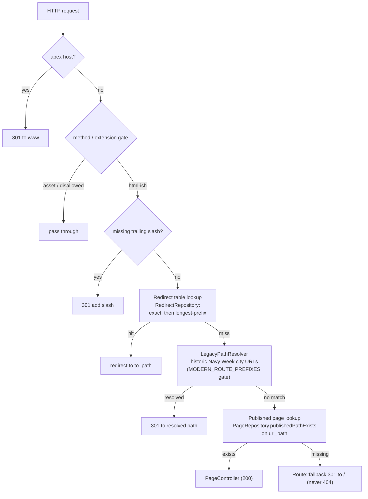

# NavyWeek Platform — architecture

Living architecture diagram for the Laravel rebuild. **Keep it current:** any change
that adds/removes a table, model, repository, middleware, service, event/listener,
or request-flow step must update this file in the same PR (see `platform/CLAUDE.md`).

Scope reflects what is **built so far**. Planned-but-not-yet-built entities are drawn
with dashed borders and are not wired up until their slice lands.

Last updated: Phase 2 slice 7 — Bases pillar: `bases` (+ `us_states` / `overseas_countries`
lookups), `region_type` discriminator, with FAQs/sources on the shared polymorphic tables.

## Domain modules & data access

Domain-first modular monolith under `app/Domain/*`. Callers depend on repository
**interfaces**; the Eloquent implementations are bound in `DomainServiceProvider`.

```mermaid
flowchart TB
    subgraph Crm["Crm module (brands / pipeline)"]
        Connection["Connection (model)"]
        ConnectionAlias["ConnectionAlias (model)"]
        ConnIface["ConnectionRepositoryInterface"]
        ConnRepo["EloquentConnectionRepository"]
        ConnStatus["enum ConnectionStatus"]
        AudienceEnum["enum Audience"]
        AudienceModel["Audience (model)<br/>offer_audience lookup"]
        ConnRepo -. implements .-> ConnIface
        ConnRepo --> Connection
        ConnRepo --> ConnectionAlias
        ConnectionAlias -->|belongsTo| Connection
        Connection -->|"duplicate_of (self-ref)"| Connection
        AudienceModel -.seeded from.-> AudienceEnum
    end

    subgraph Catalog["Catalog module (offers + affiliate)"]
        Offer["Offer (model)"]
        OfferTier["OfferTier (model)"]
        RedemptionStep["RedemptionStep (model)"]
        OfferIface["OfferRepositoryInterface"]
        OfferRepo["EloquentOfferRepository"]
        OfferType["enum OfferType"]
        Verification["enum VerificationProvider"]
        Channel["enum RedemptionChannel"]
        AffNetwork["AffiliateNetwork (model)"]
        AffLink["AffiliateLink (model)"]
        AffNetIface["AffiliateNetworkRepositoryInterface"]
        AffLinkIface["AffiliateLinkRepositoryInterface"]
        Tagger["AffiliateLinkTagger (service)<br/>port of withPlacement"]
        PlacementEnum["enum Placement"]
        OfferRepo -. implements .-> OfferIface
        OfferRepo --> Offer
        Offer -->|hasMany| OfferTier
        Offer -->|hasMany| RedemptionStep
        Offer -->|hasMany| AffLink
        AffLink -->|belongsTo| AffNetwork
        Tagger -->|reads subid_param| AffNetwork
    end

    Connection -->|"hasMany (one brand, many offers)"| Offer
    Connection -->|"default_affiliate_network_id"| AffNetwork

    subgraph Publishing["Publishing module (pages / redirects / routing)"]
        Page["Page (model)"]
        Redirect["Redirect (model)"]
        PageIface["PageRepositoryInterface"]
        PageRepo["EloquentPageRepository"]
        RedirIface["RedirectRepositoryInterface"]
        RedirRepo["EloquentRedirectRepository"]
        PageType["enum PageType"]
        RedirType["enum RedirectMatchType"]
        LegacyResolver["LegacyPathResolver (service)"]
        PageRepo -. implements .-> PageIface
        RedirRepo -. implements .-> RedirIface
        PageRepo --> Page
        RedirRepo --> Redirect
    end

    subgraph Research["Research module (briefs / skill provenance)"]
        ResearchModel["Research (model)"]
        Skill["Skill (model)"]
        ResearchIface["ResearchRepositoryInterface"]
        ResearchRepo["EloquentResearchRepository"]
        ResearchStatus["enum ResearchStatus"]
        ResearchedBy["enum ResearchedBy"]
        ResearchRepo -. implements .-> ResearchIface
        ResearchRepo --> ResearchModel
        ResearchModel -->|"belongsToMany (research_skill: skill_version, used_for)"| Skill
    end

    Connection -->|"hasMany (versioned briefs)"| ResearchModel
    Offer -.->|"optional offer-scoped brief"| ResearchModel

    Page -.->|"pageable morphTo"| Offer
    Page -.->|"pageable morphTo"| Connection

    subgraph Shared["Shared module"]
        UrlPath["UrlPath value object<br/>(trailingSlash: always)"]
        Source["Source (model)<br/>polymorphic sourceable"]
        Faq["Faq (model)<br/>polymorphic faqable"]
        ConfidenceEnum["enum ConfidenceLevel<br/>(briefs + citations)"]
        SourceTypeEnum["enum SourceType"]
        Source -.-> ConfidenceEnum
        Source -.-> SourceTypeEnum
    end

    Offer -->|"belongsToMany (offer_audience)"| AudienceModel
    Offer -.->|"morphMany sources"| Source
    ResearchModel -.->|"morphMany sources"| Source
    Page -.->|"morphMany sources"| Source
    Page -.->|"morphMany faqs"| Faq
    Offer -.->|"morphMany faqs"| Faq

    subgraph Pillars["Pillars module (reference content)"]
        BaseModel["Base (model)"]
        UsState["UsState (model)"]
        OverseasCountry["OverseasCountry (model)"]
        BaseIface["BaseRepositoryInterface"]
        BaseRepo["EloquentBaseRepository"]
        BaseTypeEnum["enum BaseType"]
        RegionTypeEnum["enum RegionType"]
        CombatantEnum["enum CombatantCommand"]
        BaseRepo -. implements .-> BaseIface
        BaseRepo --> BaseModel
        BaseModel -->|"belongsTo (state slug)"| UsState
        BaseModel -->|"belongsTo (country slug)"| OverseasCountry
        BaseModel -->|"nearby_bases (self-ref slugs, JSON)"| BaseModel
    end

    BaseModel -.->|"morphMany sources"| Source
    BaseModel -.->|"morphMany faqs"| Faq

    subgraph Planned["Planned (not yet built)"]
        Pillars2["ranks / events / fleet weeks / air shows / jet teams — Pillars"]:::planned
    end

    DSP["DomainServiceProvider<br/>(interface to implementation bindings)"]
    DSP -.binds.-> ConnIface
    DSP -.binds.-> OfferIface
    DSP -.binds.-> AffNetIface
    DSP -.binds.-> AffLinkIface
    DSP -.binds.-> ResearchIface
    DSP -.binds.-> PageIface
    DSP -.binds.-> RedirIface
    DSP -.binds.-> BaseIface

    classDef planned stroke-dasharray: 5 5,stroke:#999,color:#999;
```

## Data model (built so far)

```mermaid
erDiagram
    CONNECTIONS ||--o{ CONNECTION_ALIASES : "has keyword-variant aliases"
    CONNECTIONS ||--o| CONNECTIONS : "duplicate_of (canonical)"
    CONNECTIONS ||--o{ OFFERS : "carries offers"
    OFFERS ||--o{ OFFER_TIERS : "per-audience savings rows"
    OFFERS ||--o{ REDEMPTION_STEPS : "numbered steps (online/in-store)"
    CONNECTIONS ||--o{ RESEARCH : "versioned briefs"
    OFFERS ||--o{ RESEARCH : "optional offer-scoped brief"
    RESEARCH ||--o{ RESEARCH_SKILL : "skill provenance"
    SKILLS ||--o{ RESEARCH_SKILL : "contributed to"
    CONNECTIONS ||--o{ AFFILIATE_LINKS : "brand-level links"
    OFFERS ||--o{ AFFILIATE_LINKS : "offer links"
    AFFILIATE_NETWORKS ||--o{ AFFILIATE_LINKS : "tags via subid_param"
    AFFILIATE_NETWORKS ||--o| CONNECTIONS : "default network"
    OFFERS ||--o{ PAGES : "presented by (pageable morph)"
    CONNECTIONS ||--o{ PAGES : "presented by (pageable morph)"
    OFFERS ||--o{ OFFER_AUDIENCE : "targets cohorts"
    AUDIENCES ||--o{ OFFER_AUDIENCE : "served by offers"
    OFFERS ||--o{ SOURCES : "cited by (sourceable morph)"
    RESEARCH ||--o{ SOURCES : "cited by (sourceable morph)"
    PAGES ||--o{ SOURCES : "cited by (sourceable morph)"
    PAGES ||--o{ FAQS : "has (faqable morph)"
    OFFERS ||--o{ FAQS : "has (faqable morph)"

    CONNECTIONS {
        bigint id PK
        string slug UK
        string brand
        string key
        string category "freeform industry label (lossless)"
        string status "enum ConnectionStatus"
        int priority_tier
        bool is_backlog "active queue vs backlog"
        int max_volume
        int total_volume
        int keyword_count
        int min_difficulty
        decimal cpc
        string top_keyword
        json audiences "enum Audience array"
        int research_cadence_days "default 45"
        date last_verified_at
        date next_review_due
        bigint duplicate_of FK
        string brand_home_url
        string official_url
        string logo_url
        bigint default_affiliate_network_id FK "nullable"
        string brief_path
        datetime deleted_at "soft deletes"
    }

    CONNECTION_ALIASES {
        bigint id PK
        string alias_slug UK
        bigint connection_id FK
    }

    OFFERS {
        bigint id PK
        bigint connection_id FK
        string internal_label
        string offer_type "enum OfferType"
        string headline_discount
        text discount_summary
        string verification "enum VerificationProvider"
        string verification_url
        string official_url "falls back to connection"
        string audience_label
        json display_units "eligibility, exclusions, key_facts, promo, savings tools, share_cta"
        string cta_overrides "cta_label, cta_subnote, sticky_cta_label, source_priority_note"
        bool is_primary
        int sort_order
        bool is_published
    }

    OFFER_TIERS {
        bigint id PK
        bigint offer_id FK
        string audience
        string amount
        string note
        int sort_order
    }

    REDEMPTION_STEPS {
        bigint id PK
        bigint offer_id FK
        string channel "enum RedemptionChannel: online/in_store"
        string title
        text detail
        int sort_order
    }

    AFFILIATE_NETWORKS {
        bigint id PK
        string key UK "direct | impact | cj | awin | rakuten | avantlink | amazon"
        string name
        string subid_param "query key carrying the placement token"
        json extra_params "e.g. direct utm_source/medium"
    }

    AFFILIATE_LINKS {
        bigint id PK
        bigint connection_id FK "nullable"
        bigint offer_id FK "nullable"
        bigint affiliate_network_id FK
        string base_url
        string placement "enum Placement: hero-cta/sticky-footer/keyfacts-source"
        string rel "default sponsored noopener noreferrer"
    }

    RESEARCH {
        bigint id PK
        bigint connection_id FK
        bigint offer_id FK "nullable"
        string brief_path
        longtext raw_markdown "verbatim, zero-loss"
        text executive_summary
        json parsed "verified_facts, decision_table, maintenance, recommended_copy"
        string confidence_overall "enum ConfidenceLevel"
        date last_verified
        string researched_by "enum ResearchedBy"
        string skill_key "primary skill provenance"
        string skill_version
        string status "enum ResearchStatus"
        int version
    }

    SKILLS {
        bigint id PK
        string key UK
        string name
        string current_version
        string content_hash "bump triggers re-research"
        string source_ref
    }

    RESEARCH_SKILL {
        bigint id PK
        bigint research_id FK
        bigint skill_id FK
        string skill_version
        string used_for "facts | citability"
    }

    PAGES {
        bigint id PK
        string page_type "enum PageType"
        string slug
        string url_path UK "canonical routing key"
        string title "head/og/twitter title"
        text meta_description
        string canonical_path "canonical override, nullable"
        string og_type "default website"
        string og_image_path "site-relative, nullable"
        bool noindex "robots + suppresses org node"
        datetimetz date_published "build-clock, first build"
        datetimetz date_modified "build-clock, every build"
        json json_ld "page-specific EXTRA schema nodes"
        string pageable_type "polymorphic owner, nullable"
        bigint pageable_id "Offer / Connection / pillar, nullable"
        bool is_published
    }

    REDIRECTS {
        bigint id PK
        string from_path UK
        string to_path
        int status "default 301"
        string reason
        string match_type "exact or prefix"
        bool is_active
        int hits
    }

    AUDIENCES {
        bigint id PK
        string key UK "enum Audience value"
        string label
        int sort_order
    }

    OFFER_AUDIENCE {
        bigint id PK
        bigint offer_id FK
        bigint audience_id FK
    }

    SOURCES {
        bigint id PK
        string sourceable_type "morph: Offer/Research/Page"
        bigint sourceable_id
        string label
        string url
        string publisher
        string source_type "primary/official/…"
        date accessed_at
        string confidence "enum ConfidenceLevel"
        int sort_order
    }

    FAQS {
        bigint id PK
        string faqable_type "morph: Page/Offer/Base/pillar"
        bigint faqable_id
        string question
        text answer
        int sort_order
    }

    US_STATES ||--o{ BASES : "state-based bases (state slug)"
    OVERSEAS_COUNTRIES ||--o{ BASES : "overseas bases (country slug)"
    BASES ||--o{ SOURCES : "cited by (sourceable morph)"
    BASES ||--o{ FAQS : "has (faqable morph)"

    US_STATES {
        bigint id PK
        string slug UK
        string name
        string abbr
    }

    OVERSEAS_COUNTRIES {
        bigint id PK
        string slug UK
        string name
        string iso2
        string region "enum CombatantCommand"
        bool is_us_territory
    }

    BASES {
        bigint id PK
        string slug UK
        string name
        string type "enum BaseType (hub)"
        string region_type "enum RegionType: state/country/territory"
        string state "us_states slug (soft FK)"
        string country_slug "overseas_countries slug (soft FK)"
        string region "enum CombatantCommand, nullable"
        decimal lat
        decimal lng
        int established
        json aka_major_units_key_facts_notable_events "cohesive display lists"
        json nearby_bases "self-ref slugs"
        string nearest_fleet_week_slug "soft link (pillar not built)"
        longtext overview_history
        date last_updated "base's own label, not build clock"
    }
```

> `pages` now carries the full SEO/JSON-LD head-meta layer (title, description,
> canonical override, OG, robots), the build-clock Article dates, a `json_ld` slot
> for page-specific EXTRA schema nodes, and the polymorphic `pageable` owner
> (Offer/Connection today; pillars when those land). Derived schema — the auto
> `Organization` node and the aggregate-driven `Article`/`LocalBusiness` — is
> composed at render time from `pageable`, never stored, so the graph can't drift.
> The page **body** columns land with the Phase 3 rendering slice (aggregate-backed
> pages derive their body from the Offer/Connection; only static pages need stored
> body). `connections.category` is kept as the raw industry string; the category-hub
> FK lands with the rendering slice.

> **Shared taxonomy (slice 6).** `audiences` is a small lookup seeded from the
> `Audience` enum (its `label` is a seeded default the CMS can later override);
> `offer_audience` normalizes the legacy 9 audience booleans (now 7 enum cases) into a many-to-many so
> offers can be filtered by cohort and JSON-LD can enumerate them. Audience is
> represented at **two levels on purpose**: `connections.audiences` (JSON enum
> collection) is the coarse brand-level tag set for CRM filtering, while
> `offer_audience` is the precise per-offer eligibility that drives page rendering
> and schema — the pivot is authoritative for an offer; the connection JSON is not
> migrated onto it.
> `sources` (citations) and `faqs` are **polymorphic** — one table each, morphed onto
> Offer/Research/Page (sources) and Page/Offer (faqs, later pillars). FAQs are the
> single source for both the rendered FAQ and its FAQPage JSON-LD, so the hard
> schema↔content parity gate compares them against one row set. These shared/lookup
> tables carry no repository of their own — reads route through the aggregate they
> hang off (the Offer repository eager-loads `audiences` + `sources` on the
> `/discount/` path). Polymorphic rows have no DB-level cascade; parent hard-deletes
> that should also drop citations/FAQs are handled when the Filament relation
> managers / importers land.

> **Bases pillar (slice 7).** First of the reference pillars. `region_type`
> (state/country/territory) is the discriminator that decides which column group
> applies — state fields (`state`/`state_name`/`state_abbr`) for CONUS, or the
> overseas block (`country_slug`/`region`/`host_nation`/`timezone`/…) for OCONUS —
> and whether the base is overseas. `state` and `country_slug` are **soft slug FKs**
> to the `us_states` / `overseas_countries` lookups (a base has exactly one, never
> both), joined by slug, not enforced by a DB constraint. `nearest_fleet_week_slug`
> is a bare slug until the fleet-weeks pillar lands. The base's `state_name`/
> `state_abbr` (and, overseas, `country`/`country_iso2`/`region`) are **intentionally
> denormalized** — they are the base's own authoritative display values in the legacy
> data, while the `us_states`/`overseas_countries` lookups exist to drive the hub
> pages (grouping/listing), not to source a base's rendering. They coincide today; a
> `bases:reconcile` validator (successor to the legacy build-time checks) can flag any
> drift later. Base **FAQs and sources reuse
> the shared polymorphic `faqs`/`sources` tables** (faqable/sourceable → Base)
> rather than JSON columns — the reason those were made polymorphic in slice 6;
> only the cohesive, base-specific display lists (`aka`, `major_units`, `key_facts`,
> `notable_events`, `nearby_bases`) stay JSON. Base pages (pageable → Base) and the
> body columns arrive with the Phase 3 rendering slice. Remaining reference pillars
> (ranks, events, fleet weeks, air shows, jet teams, local discounts, veterans-day
> meals) land in subsequent slices.

## Request / redirect pipeline

`CanonicalUrlMiddleware` is registered **global + first**, before the (Phase 6)
response cache, so 301s are never mis-cached. It ports the legacy Vercel
`middleware.ts` order 1:1.

## References

- Module responsibilities + commands: `platform/README.md`
- Full rebuild plan and SEO invariants: root `CLAUDE.md`
