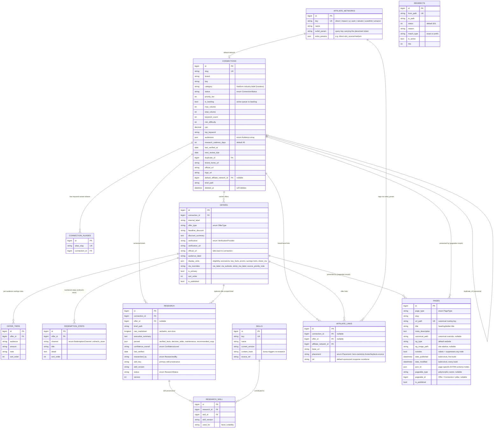
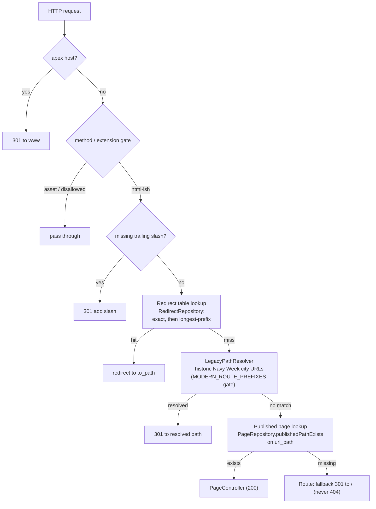

# NavyWeek Platform — architecture

Living architecture diagram for the Laravel rebuild. **Keep it current:** any change
that adds/removes a table, model, repository, middleware, service, event/listener,
or request-flow step must update this file in the same PR (see `platform/CLAUDE.md`).

Scope reflects what is **built so far**. Planned-but-not-yet-built entities are drawn
with dashed borders and are not wired up until their slice lands.

Last updated: Phase 2 slice 5 — Pages SEO/JSON-LD extension (head meta, build-clock
dates, page-specific `json_ld`, polymorphic `pageable`).

## Domain modules & data access

Domain-first modular monolith under `app/Domain/*`. Callers depend on repository
**interfaces**; the Eloquent implementations are bound in `DomainServiceProvider`.

```mermaid
flowchart TB
    subgraph Crm["Crm module (brands / pipeline)"]
        Connection["Connection (model)"]
        ConnectionAlias["ConnectionAlias (model)"]
        ConnIface["ConnectionRepositoryInterface"]
        ConnRepo["EloquentConnectionRepository"]
        ConnStatus["enum ConnectionStatus"]
        Audience["enum Audience"]
        ConnRepo -. implements .-> ConnIface
        ConnRepo --> Connection
        ConnRepo --> ConnectionAlias
        ConnectionAlias -->|belongsTo| Connection
        Connection -->|"duplicate_of (self-ref)"| Connection
    end

    subgraph Catalog["Catalog module (offers + affiliate)"]
        Offer["Offer (model)"]
        OfferTier["OfferTier (model)"]
        RedemptionStep["RedemptionStep (model)"]
        OfferIface["OfferRepositoryInterface"]
        OfferRepo["EloquentOfferRepository"]
        OfferType["enum OfferType"]
        Verification["enum VerificationProvider"]
        Channel["enum RedemptionChannel"]
        AffNetwork["AffiliateNetwork (model)"]
        AffLink["AffiliateLink (model)"]
        AffNetIface["AffiliateNetworkRepositoryInterface"]
        AffLinkIface["AffiliateLinkRepositoryInterface"]
        Tagger["AffiliateLinkTagger (service)<br/>port of withPlacement"]
        PlacementEnum["enum Placement"]
        OfferRepo -. implements .-> OfferIface
        OfferRepo --> Offer
        Offer -->|hasMany| OfferTier
        Offer -->|hasMany| RedemptionStep
        Offer -->|hasMany| AffLink
        AffLink -->|belongsTo| AffNetwork
        Tagger -->|reads subid_param| AffNetwork
    end

    Connection -->|"hasMany (one brand, many offers)"| Offer
    Connection -->|"default_affiliate_network_id"| AffNetwork

    subgraph Publishing["Publishing module (pages / redirects / routing)"]
        Page["Page (model)"]
        Redirect["Redirect (model)"]
        PageIface["PageRepositoryInterface"]
        PageRepo["EloquentPageRepository"]
        RedirIface["RedirectRepositoryInterface"]
        RedirRepo["EloquentRedirectRepository"]
        PageType["enum PageType"]
        RedirType["enum RedirectMatchType"]
        LegacyResolver["LegacyPathResolver (service)"]
        PageRepo -. implements .-> PageIface
        RedirRepo -. implements .-> RedirIface
        PageRepo --> Page
        RedirRepo --> Redirect
    end

    subgraph Research["Research module (briefs / skill provenance)"]
        ResearchModel["Research (model)"]
        Skill["Skill (model)"]
        ResearchIface["ResearchRepositoryInterface"]
        ResearchRepo["EloquentResearchRepository"]
        ResearchStatus["enum ResearchStatus"]
        ResearchedBy["enum ResearchedBy"]
        Confidence["enum ConfidenceLevel"]
        ResearchRepo -. implements .-> ResearchIface
        ResearchRepo --> ResearchModel
        ResearchModel -->|"belongsToMany (research_skill: skill_version, used_for)"| Skill
    end

    Connection -->|"hasMany (versioned briefs)"| ResearchModel
    Offer -.->|"optional offer-scoped brief"| ResearchModel

    Page -.->|"pageable morphTo"| Offer
    Page -.->|"pageable morphTo"| Connection

    subgraph Shared["Shared module"]
        UrlPath["UrlPath value object<br/>(trailingSlash: always)"]
    end

    subgraph Planned["Planned (not yet built)"]
        Pillars["bases / ranks / events — Pillars"]:::planned
        SharedTaxonomy["sources / faqs / audience pivot — Shared"]:::planned
    end

    DSP["DomainServiceProvider<br/>(interface to implementation bindings)"]
    DSP -.binds.-> ConnIface
    DSP -.binds.-> OfferIface
    DSP -.binds.-> AffNetIface
    DSP -.binds.-> AffLinkIface
    DSP -.binds.-> ResearchIface
    DSP -.binds.-> PageIface
    DSP -.binds.-> RedirIface

    classDef planned stroke-dasharray: 5 5,stroke:#999,color:#999;
```

## Data model (built so far)

> `pages` now carries the full SEO/JSON-LD head-meta layer (title, description,
> canonical override, OG, robots), the build-clock Article dates, a `json_ld` slot
> for page-specific EXTRA schema nodes, and the polymorphic `pageable` owner
> (Offer/Connection today; pillars when those land). Derived schema — the auto
> `Organization` node and the aggregate-driven `Article`/`LocalBusiness` — is
> composed at render time from `pageable`, never stored, so the graph can't drift.
> The page **body** columns land with the Phase 3 rendering slice (aggregate-backed
> pages derive their body from the Offer/Connection; only static pages need stored
> body). `connections.category` is kept as the raw industry string; the category-hub
> FK lands with the rendering slice.

## Request / redirect pipeline

`CanonicalUrlMiddleware` is registered **global + first**, before the (Phase 6)
response cache, so 301s are never mis-cached. It ports the legacy Vercel
`middleware.ts` order 1:1.

## References

- Module responsibilities + commands: `platform/README.md`
- Full rebuild plan and SEO invariants: root `CLAUDE.md`
